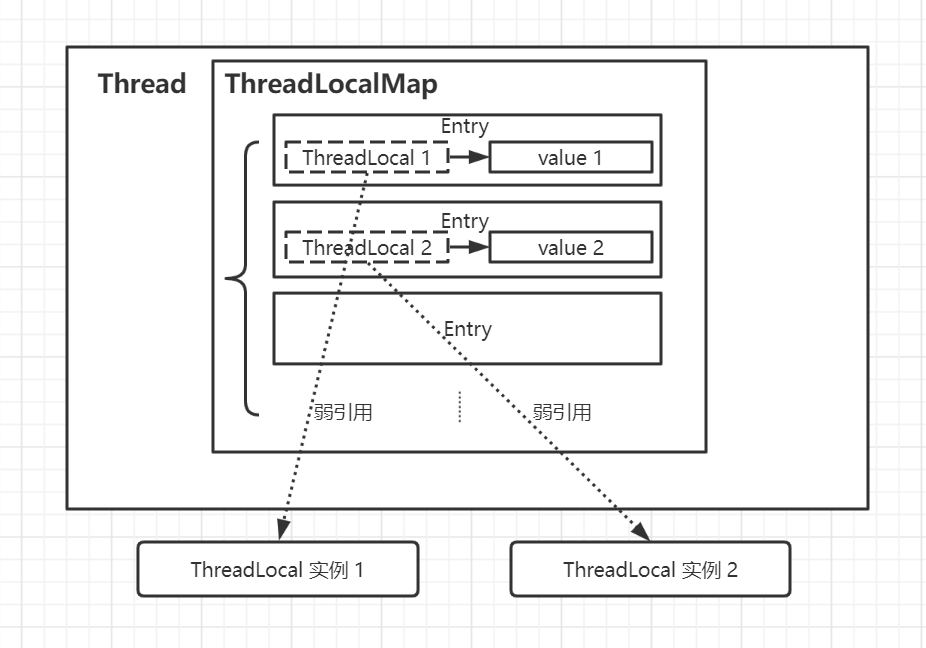

# ThreadLocal到底会造成内存泄露吗

这是java领域常见的一个问题。AI时代，分别问问`GPT4/Claude/Bard`。
几家ai都给出了肯定回答："Yes, java.lang.ThreadLocal can cause memory leak if it is not used correctly."

其中`Claude`还给了如何溢出的示例。

```java
//Claude 给了如何溢出的示例
public class MemoryLeakExample {
    public static ThreadLocal<Foo> tl = new ThreadLocal<>();

    public static void main(String[] args) {
        new Thread() {
            public void run() {
                tl.set(new Foo()); // Store Foo in ThreadLocal
            }
        }.start(); 
    }
}
public class Foo {
    private byte[] buffer = new byte[100]; // Holds reference to byte array 
}
```
也给出了避免溢出的办法：
```java
// 在之前tl.set完，最后加一行代码
tl.remove(); // Remove ThreadLocal to avoid memory leak
```
不过到底会不会引起溢出呢？先卖个关子。

`ThreadLocal`和Thread其实是多对多的关系。
它们之间通过`ThreadLocalMap`做桥梁，ThreadLocalMap和Thread是一对一的（`Thread.threadLocals`变量）:


```java
/* ThreadLocal values pertaining to this thread. This map is maintained
    * by the ThreadLocal class. */
ThreadLocal.ThreadLocalMap threadLocals = null;
```


图片来源：http://concurrent.redspider.group/article/03/21.html

所谓泄漏就是`ThreadLocalMap`下面这个`Entry[]`数组而言，key（`ThreadLocal`）对象已经回收，而`value`仍然存在的场景。
那这种场景会不会出现呢？出现后的影响有多大呢？
其实JDK里有描述这种`Entry`,叫`"stale entries"`(失效记录)。

```java
// ThreadLocalMap.java 部分源码
    /**
     * The entries in this hash map extend WeakReference, using
     * its main ref field as the key (which is always a
     * ThreadLocal object).  Note that null keys (i.e. entry.get()
     * == null) mean that the key is no longer referenced, so the
     * entry can be expunged from table.  Such entries are referred to
     * as "stale entries" in the code that follows.
     */
    static class Entry extends WeakReference<ThreadLocal<?>> {
        /** The value associated with this ThreadLocal. */
        Object value;

        Entry(ThreadLocal<?> k, Object v) {
            super(k);
            value = v;
        }
    }
```

这里把`ThreadLocal`作为弱引用，ThreadLocal本身不再被强引用的时候就会被回收。但`Entry`本身不会。
响应的`value`也不会。回收的只是作为`key`的`ThreadLocal`对象。

考虑到这一点，`JDK`做了保底策略：
* set的时候如果新增了`Entry`或者替换了`Stale Entry`,执行启发式清理`cleanSomeSlots`,log2(n) cells会被扫描，达到内存和性能的平衡。
  * 碰到`Stale`,则开始执行`expungeStaleEntry`渐进式清理
  * 从当前位置往后检查是否还有`Stale`，直到碰到table中的NULL位置结束；
  * 靠后的存活`Entry`会尝试前移，进行一次整理。
* get的时候（没有Entry会初始化set）碰到了冲突的`Entry`,也会检查是否`Stale`，如果是执行`expungeStaleEntry`渐进式清理。
* remove的时候执行`expungeStaleEntry`渐进式清理。

由此可见，JDK尽可能的做了自动清理，但这不是100%保证会清理掉，但是泄漏也不会无限（set操作的时候会触发清理）
类似redis中的`渐进式rehash`(把一次性大量工作分摊到每个添加、删除、查找和更新操作上)。


下面我们写点代码验证一下。

即然泄漏，肯定不能调用`remove`方法了；同时也要让线程存活，不然线程销毁的时候都会回收的。

无非几种情况：

* 线程内创建`ThreadLocal`（局部）,set完就扔
  * 一种是执行有限次，GC后查看内存占用
  * 一种是无限运行，查看程序是否内存占满无法运行
  * 不过这种情况也失去了ThreadLocal的意义，后续方法拿不到（除非再显示传参过去，不过都直接传参了，还用`ThreadLocal`干什么？）
* 全局创建`ThreadLocal`,只set不remove

首先定义一个可观察的数据变量:

```java
static class SomeData {
    static final AtomicInteger GC_CNT = new AtomicInteger();
    // 5MB
    private byte[] data = new byte[5 << 20];

    @Override
    protected void finalize() throws Throwable {
        //便于观察回收情况
        System.out.println(this + " finalize :" + GC_CNT.incrementAndGet());
    }
}
```

定义固定5个线程的线程池：
```java
final static ExecutorService EXES =  Executors.newFixedThreadPool(5);
static final int DATA_TOTAl = 50;
```

## 局部ThreadLocal


```java
static void testMoreThreadMem__Leak() throws IOException, InterruptedException {
    var cnt = new CountDownLatch(DATA_TOTAl);
    for (int i = 0; i < DATA_TOTAl; ++i) {
        EXES.execute(() -> {
            var local= new ThreadLocal<SomeData>();
            local.set(new SomeData());

            System.out.println( Thread.currentThread().getName() + " -> :"+ local.get());
            cnt.countDown();
        });
    }
    cnt.await();
    System.gc();
    //等下GC完成
    Thread.sleep(2000);
    System.out.println("begin to expungeStaleEntry indirectly , current has " + (DATA_TOTAl - SomeData.GC_CNT.get()) +" unused.");
    indirectlyExpungeStaleEntry();
}
```

在`indirectlyExpungeStaleEntry`执行之前，发现有10～25个没用的`Stale`不等。为啥不是50？（前面已经说过了，set过程中有清理）。
间接清理也简单，继续创建`ThreadLocal`,执行几次get即可。

```java
static void indirectlyExpungeStaleEntry() throws InterruptedException {
    // A. 共享会造成固定位置扫描，部分地方可能一直扫描不到
    var local = new ThreadLocal<Integer>();
    var maxTry = 10;
    var GC_CNT = SomeData.GC_CNT;
    while (maxTry>0){
        if(GC_CNT.get() == DATA_TOTAl){
            System.out.println("You are luck! ALL data cleaned by expungeStaleEntry.Now is no leak.Bye");
            System.exit(0);
        }
        var cleaned = GC_CNT.get();
        // B. 换成局部变量，更有机会去扫描expungeStaleEntry
        // var local = new ThreadLocal<Integer>();
        for (int i = 0; i < 50; ++i) {
            //调用get也会触发expungeStaleEntry
            EXES.execute(() -> local.get());
        }
        System.gc();
        //等下GC完成
        Thread.sleep(2000);
        maxTry --;
        System.out.println("try to indirect expungeStaleEntry "+ maxTry +" itor:  cleaned "+( GC_CNT.get() - cleaned) +" data, still has "+(DATA_TOTAl - GC_CNT.get()) +" unused.");
    }
    System.out.println("mem leaked with "+(DATA_TOTAl - GC_CNT.get()) +" unused.");
    //System.exit(0);
}
```

不过这里也发现一个有意思的现象，如果是用共享local,如代码中`A.`那样,其实是清理不干净的，几次迭代之后就不再有变化。
同一个引用，不会触发rehash,每次的位置也固定，造成了渐进式的盲区(换成set/remove也一样）。
如何清理干净？换成代码中`B.`那行即可，每次迭代创建一个local。

```txt
begin to expungeStaleEntry indirectly , current has 20 unused.
test.sync.LocalMem$SomeData@693b2984 finalize :31
test.sync.LocalMem$SomeData@47200cbb finalize :32
try to indirect expungeStaleEntry 9 itor:  cleaned 2 data, still has 18 unused.
test.sync.LocalMem$SomeData@4485e789 finalize :33
test.sync.LocalMem$SomeData@776f8681 finalize :34
test.sync.LocalMem$SomeData@7bfd77c4 finalize :35
test.sync.LocalMem$SomeData@471a206d finalize :36
test.sync.LocalMem$SomeData@680d5f83 finalize :37
test.sync.LocalMem$SomeData@40979001 finalize :38
test.sync.LocalMem$SomeData@4cab5964 finalize :39
test.sync.LocalMem$SomeData@6366a197 finalize :40
test.sync.LocalMem$SomeData@834a6b7 finalize :41
try to indirect expungeStaleEntry 8 itor:  cleaned 9 data, still has 9 unused.
try to indirect expungeStaleEntry 7 itor:  cleaned 0 data, still has 9 unused.
try to indirect expungeStaleEntry 0 itor:  cleaned 0 data, still has 9 unused.
mem leaked with 9 unused.
```

### 无限循环，可以一直运行吗

set也会触发渐进式清理，那么理论上会有一个平衡，不会无限溢出。让我们验证一下：
```java
//java -Xmx512m test/sync/testMem__Leak_Balance
static void testMem__Leak_Balance() throws IOException, InterruptedException {

    //var cnt = new CountDownLatch(DATA_TOTAl);
    var i = new AtomicInteger();
    while (true){
        EXES.execute(() -> {
            var local = new ThreadLocal<SomeData>();
            local.set(new SomeData());

            System.out.println( Thread.currentThread().getName() + " -> :" + local.get());
            System.out.println("has unused data" + (i.incrementAndGet() - SomeData.GC_CNT.get()));
            //cnt.countDown();
        });
    }
}
```

指定512MB内存，能一直运行还是OutOfMemoryError无法运行呢？

```txt
pool-1-thread-45 -> :test.sync.LocalMem$SomeData@4decb284
has unused data-4
pool-1-thread-49 -> :test.sync.LocalMem$SomeData@1726e20d
has unused data-3
pool-1-thread-46 -> :test.sync.LocalMem$SomeData@2e5e8e0a
has unused data-2
pool-1-thread-45 -> :test.sync.LocalMem$SomeData@79b7738a
has unused data-1
pool-1-thread-49 -> :test.sync.LocalMem$SomeData@5325c9ff
has unused data0
pool-1-thread-48 -> :test.sync.LocalMem$SomeData@3ba7679c
```


## 全局用法

```java
static void testNThreadMemKeep() throws InterruptedException {
    var local= new ThreadLocal<SomeData>();
    for (int i = 0; i < DATA_TOTAl; ++i) {
        EXES.execute(() -> {
            local.set(new SomeData());
            System.out.println( Thread.currentThread().getName() + " -> :"+ local.get());
        });
    }

    while (true){
        var left =  SomeData.GC_CNT.get();
        System.gc();
        //等下GC完成
        Thread.sleep(2000);
        if(SomeData.GC_CNT.get() == left){
            System.out.println("current has " + (DATA_TOTAl - left) + " cached data, which must the same with thread cnt.");
            break;
        }
    }
    //执行完后，如果不再进行任何ThreadLocal操作，这几个线程里面的内存会一直存在。
}
```

最后存活几个线程，保有几份数据。除非手动调用`remove`,才会清理掉。

### 最佳实践

* 全局保留`ThreadLocal`
* set之后记得finally里执行`remove`

```java
static class BestPractice implements Runnable{
    static final ThreadLocal<SomeData> LOCAL = new ThreadLocal<>();
    @Override
    public void run() {
        var data = new SomeData();
        try {
            LOCAL.set(data);
            System.out.println("call some method in this Thread. name end：" + Thread.currentThread().getName() + " -> :"+ LOCAL.get());
        }finally {
            LOCAL.remove();
        }
    }
}
```

## 总结

造成内存泄漏的原因是`ThreadLocal`本身引用断掉所造成的`Stale Entry`(key为null)没有被及时清理（线程复用的前提下）。
而清理的触发机制是在调用暴露的公开方法中：`set`/`get`/`remove`。
如果一直调用这些方法，也会达到一个动态平衡，顶多算内存浪费（容易引起Full GC）。
用起来的话还是记得最佳实践：）

文中相关代码已放在 [github:example-threadlocal](https://github.com/martin2038/example-threadlocal)

tips：`Claude`给的示例不会泄漏。
